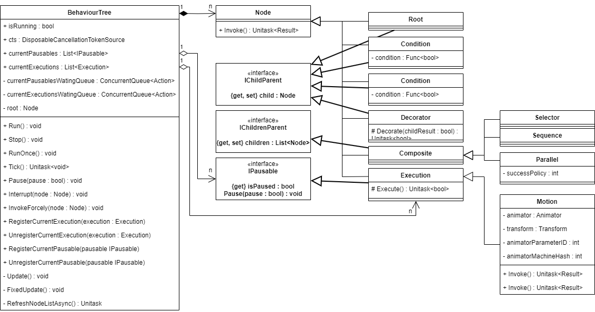

# UnitaskBehaviourTree

  - This behavior tree is designed as a model that can wait and resume tree traversal at a specific node. 
  - This tree can hierarchically separate several trees, and the behavior of the main tree can be determined by the behavior of each distributed tree.
  - You can also wait / pause / interrupt many tasks parallelly.
  - Unitask is used to minimize garbage collection and invoke node on specific unity engine's flow timing.
  - Derive the basic nodes to make your own nodes.

## Requirements:
  - Unitask 2.3.3

## Concept:
  
  
　

## Example:
  ```
  public class Move : Motion {}  
  public class Fall : Motion {}  
  public class Attack : Motion {}  
  public class AirAttack : Motion {}
  
  public class BehaviourTree : MonoBehaviour
  {
    ...
    #region Builder
    
    public BehaviourTree Move()
    {
        Node node = new Move(this);
        AttachAsChild(_current, node);
        if (_compositeStack.Count > 0)
            _current = _compositeStack.Peek();
        else
            _current = null;

        return this;
    }
    
    public BehaviourTree Fall()
    {
        Node node = new Move(this);
        AttachAsChild(_current, node);
        if (_compositeStack.Count > 0)
            _current = _compositeStack.Peek();
        else
            _current = null;

        return this;
    }
    
    #endregion
    ...
  }
    
  
  public class Example : Monobehaviour
  {
    public BehaviourTree aiTree;
    public BehaviourTree attackCommandTree;
    public Attack attack;
    public AirAttack airAttack;
    public Move move;
    public Fall fall;
    public GroundDetector groundDetector;
    
    private void Awake()
    {
      aiTree = gameObject.AddComponent<BehaviourTree>();
      attackCommandTree = gameObject.AddComponent<BehaviourTree>();
      attack = new Attack(aiTree);
      airAttack = new airAttack(aiTree);
      move = new Move(aiTree);
      fall = new Fall(aiTree);
      
      // build ai
      aiTree.StartBuild()
      .Select()
          .Condition(() => groundDetector.isDetected == false)
              .Fall()         
          .Move()
      .ExitCurrentComposite();
      
      // build attack command
      attackCommandTree.StartBuild()
      .Select()
          .Condition(() => groundDetector.isDetected == false)
              .Execution(() => _aiTree.InvokeForcely(airAttack))
          .Execution(() => _aiTree.InvokeForcely(attack))
      .ExitCurrentComposite();
      
      aiTree.Run();
    }
    
    private void Update()
    {
      if (Input.GetKeyDown(KeyCode.A))
      {
        attackCommandTree.RunOnce();
      }
    }
  }
  
  ```
